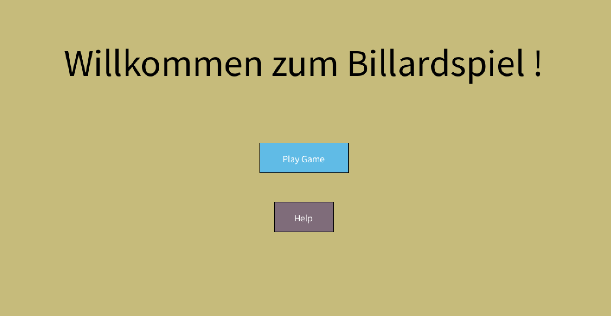
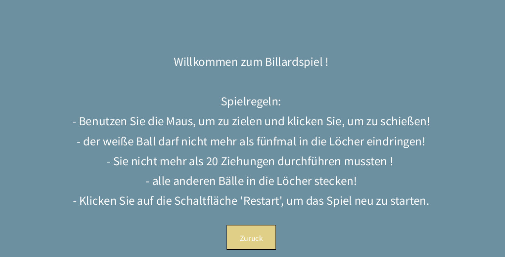
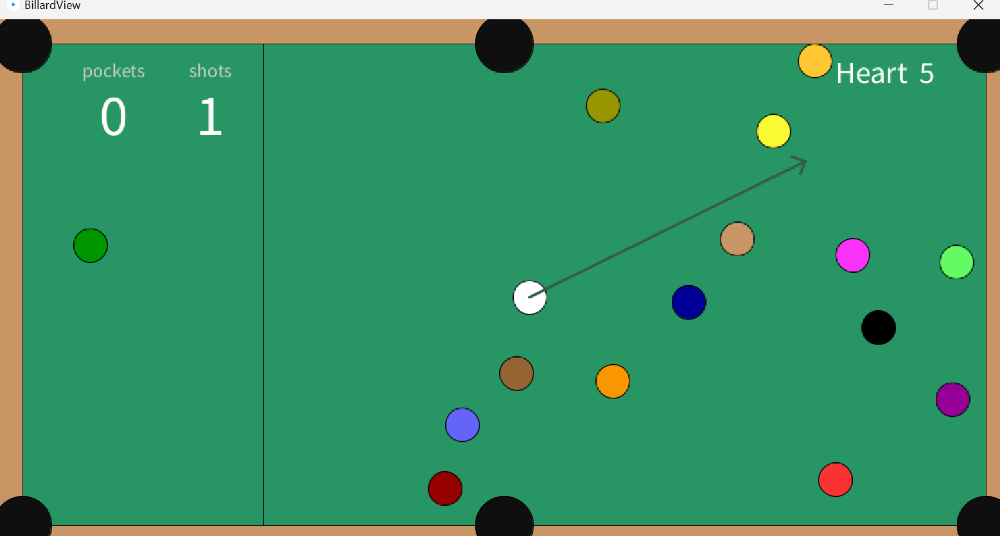
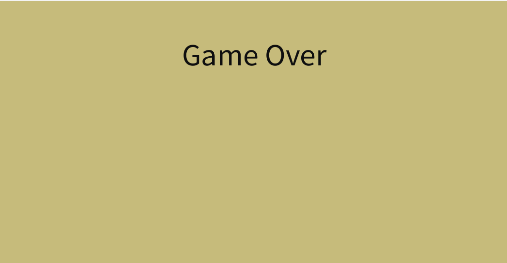
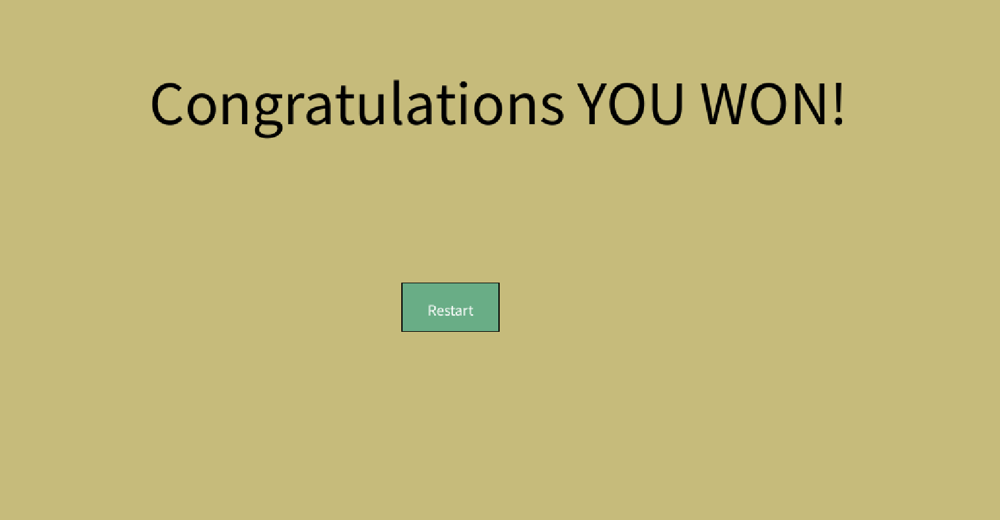

## Billard Spiel

## Inhaltsverzeichnis

- Kurzbeschreibung
- Screenshots 
- Programm starten
- JShell 
- Funktionen 
- Erste Schritte 
- Spielregeln 
- Steuerung
- Abhängigkeiten 


## Kurzbeschreibung

Das Billardspiel ist ein einfaches 
Spiel, das mithilfe der Processing-Bibliothek 
in Java implementiert wurde. 
Es simuliert einen Billardtisch mit Bällen und Löchern. Ziel ist es, 
die Bälle in die Löcher zu befördern und zu verhindern, 
dass der weiße Ball ebenfalls hineinfällt.

## Screenshots
* Start

* Help

* Game start

* Gane playing

* Game Over

* Game Win


## Programm starten

1. Führen Sie die `Main`-Klasse aus.
2. klicken Sie auf den Play Game Button, um das Spiel zu starten oder neu zu starten.

## JShell
```
jshell --class-path .\out\production\Billard_projekt

import Model.Table
import Model.Ball

var table = new Table(0,0,500,20)
System.out.println(table.getBalls().length)

table.removeBallFromTable();
System.out.println(table.getBalls().length)

```

## Funktionen 

- Realistische Bewegungen und Kollisionen der Kugeln auf einem virtuellen Billardtisch. 
- Punktesystem zum Verfolgen erfolgreicher Stöße. 
- Neustarttaste für einen neuen Spielstart.
- Endspielbedingungen mit Gewinn- und Verlustszenarien. 
- Reaktive Benutzeroberfläche mit Schaltflächen für eine einfache Navigation.

## Spielregeln

- Das Ziel ist es, alle Kugeln (außer der weißen) einzulochen. 
- Die weiße Kugel darf nicht öfter als eine bestimmte Anzahl von Malen eingelocht werden(maximal fünfmal).
- Jede erfolgreich eingelochte Kugel bringt Punkte ein. 
- Das Spiel endet, wenn alle Kugeln eingelocht sind oder wenn der weiße Ball mehr als fünfmal in die Löcher eingelocht wird. 

## Steuerung

- Verwende die Maus, um zu zielen. 
- Klicke, um mit der weißen Kugel zu stoßen. 
-  Es gibt Schaltflächen, um das Spiel bei einem Sieg  neu zu starten.

## Abhängigkeiten

- Dieses Projekt ist von der Processing-Bibliothek abhängig, die von https://processing.org/ heruntergeladen werden kann.  
- Die "JUnit"-Bibliothek ist ein Framework für das Unit-Testing, mit dem wiederholbare automatisierte 
Tests in Java geschrieben und ausgeführt werden können(mehr dazu https://mvnrepository.com/artifact/junit/junit)


